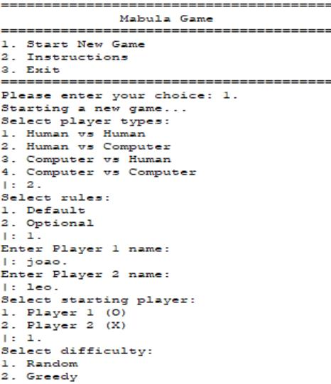
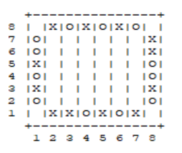
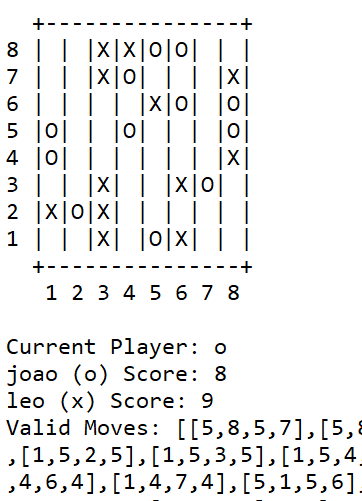
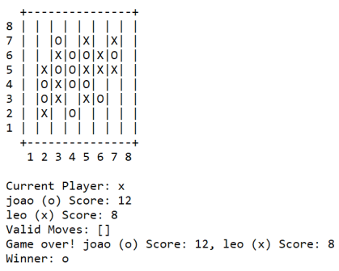
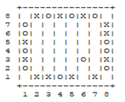

# README

Group: Mabula_6

Game Name: Mabula

## Group Members:

João Paulo Silva Santos 202006525

Leonardo de Sousa Magalhães Teixeira 202208726

## Contribution Breakdown:

Leonardo 60%

João 40%

The group members collaborated throughout the project, with Leonardo taking on more complex tasks, resulting in a distribution of effort of approximately 60% (Leonardo) and 40% (João).

## How to execute the game:

1. Open SICStus Prolog
2. Open File...
3. Open Working Directory...
4. Open your project folder (src)
5. Execute the comand ```[game].```
6. The game menu opens and you are free to play.

## Description of the Game and Rules:

In **_Mabula_** , each of the two players start with 12 marbles in their color on the perimeter of the playing area. Placement of the marbles is randomized as long as no color has more than two marbles in a row, even around a corner.
On a turn, a player chooses a marble on the perimeter of the board, then moves it as many spaces as they wish across the board. If other marbles lie in this line, push them ahead of this marble, with the only restriction being that you can't push a marble so far that other marbles are pushed into the perimeter of play. Keep taking turns until no player can go. Whoever has the largest orthogonally connected group of marbles wins.
Alternatively, you can decide before starting that a player's score will be the product of the sizes of all of their groups. In this situation, the maximum score is 81 (3x3x3x3).

## Considerations for Game Extensions

The board is 8x8, just as the official rules of Mabula.

Two different rules:

- Default: the winner is determined by the longest orthogonal connection of pieces of their symbol on the board.
- Optional: the winner is determined by the product of the sizes of all their orthogonal connections of pieces.

Difficulty Levels for AI:

AI difficulty can be configured as either random (easy) or greedy (hard) in the menu.pl file, allowing human players to choose their level of challenge.

## Game Logic

**Game Configuration Representation** : The game configuration is represented by a combination of the board size, player types (Human or Computer), player names, starting player, type of rules and difficulty levels. This configuration is passed as an argument to the initial_state/predicate, which initializes the game state accordingly.




**Internal Game State Representation** : The game state is represented as a list of lists, where each cell contains atoms representing the marbles. For example, an initial game state might look like:



Where “O” represents player1, and “X” represents player2.

Intermediate and final game states might look like this, respectively:





**Move Representation** : A move is represented by the starting and ending coordinates of the marble being moved. The move/3 predicate takes this information and updates the game state accordingly. For example, a move might look like:



Player 1 moves from position (6, 1) to position (6,3).

**User Interaction** : The user interacts with the game through the menu, where they can select the game type, AI difficulty, and other settings. Input validation ensures that players select valid moves and configurations. The game also provides feedback, such as invalid inputs or instructions when necessary. (example: “Invalid move, please try again”.)

## Conclusions

The Mabula game was successfully implemented in Prolog, with clear game logic and AI functionality. The primary limitations of the program are:

The AI is limited to two difficulty levels: random and greedy.

The user interface is text-based and could be improved with a graphical interface in the future.

## Bibliography

Official Mabula Game Rules: https://boardgamegeek.com/boardgame/346743/mabula

https://www.youtube.com/watch?v=ocOUEs65kKI&ab_channel=StrategoKanal
